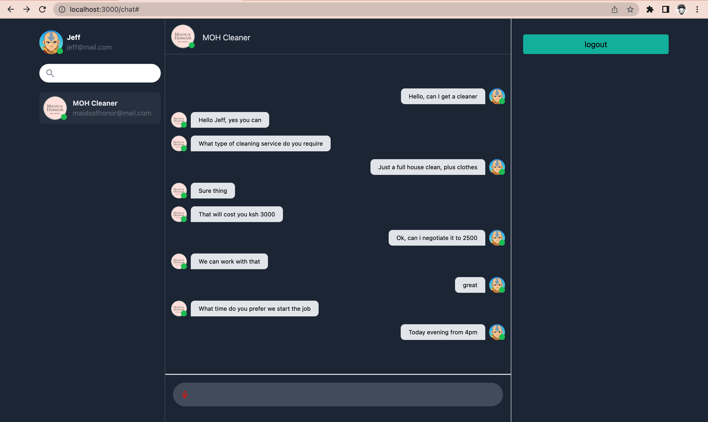

# SOGA
A realtime chat application built with React, Redux, Express, SocketIO and MongoDB.

## Installation

Install frontend dependencies

```bash
cd frontend
npm install

// start server
npm start
```

Install backend dependencies

```bash
cd backend
npm install

// start server
npm start
```

## Technology Used

#### Frontend

- [React](https://reactjs.org/)
- [Redux-Toolkit](https://redux-toolkit.js.org/)
- [Tailwind CSS](https://tailwindcss.com/)
- [React-Hooks-From](https://react-hook-form.com/)

#### Backend

- [Express](https://reactjs.org/)
- [MongoDB](https://www.mongodb.com/)
- [SocketIO](https://socket.io/)

#### Screen

Chat View


